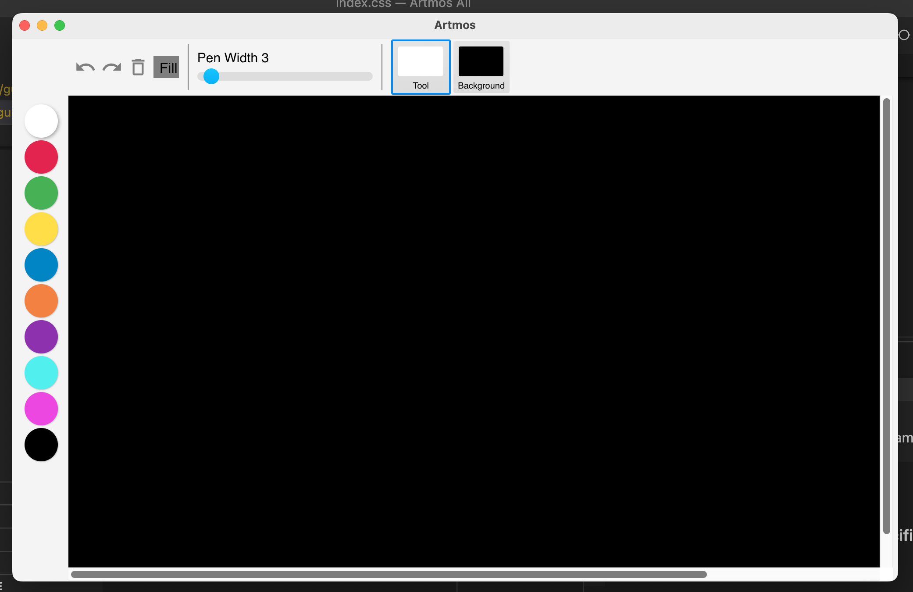

# What is Artmos Pro?

Artmos Pro is a vector-based comprehensive painting tool designed for creating high quality educational videos.

# Building

As a `Node.js/Electron` app, building from the source follows these steps:
- `npm i` to install dependencies
- `npm start` to start the app

# Screenshot

